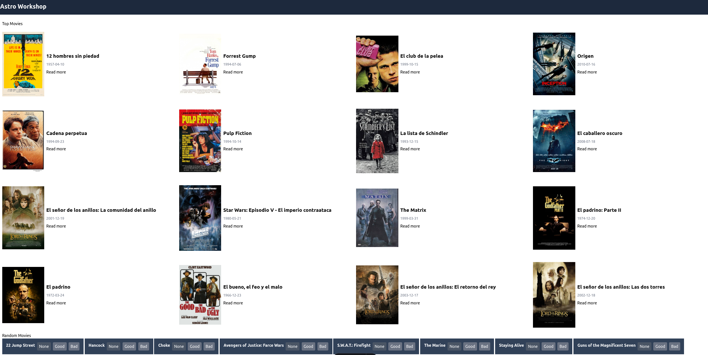

# Astro Workshop

TODO

- [ ] Create movies page
- [ ] Create movies collection
- [ ] Create TopMovieCard component
- [ ] Create TopMoviesList component
- [ ] Create movie detail page
- [ ] Add View Transitions
- [ ] Configure env vars to use https://jsonfakery.com/movies/random/10
- [ ] Create RandomMovieCard component
- [ ] Create server island for RandomMoviesList
- [ ] Change output to server and set prerendering to true in pages
- [ ] Add Preact integration
- [ ] Create Rating Preact client island
- [ ] Create Rate movie action
- [ ] Add an adapter and deploy!

